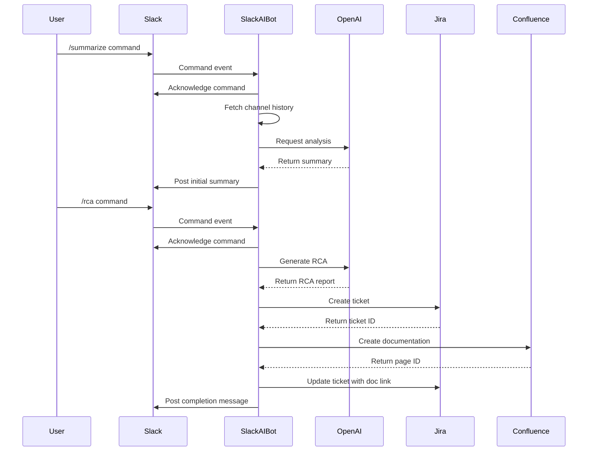
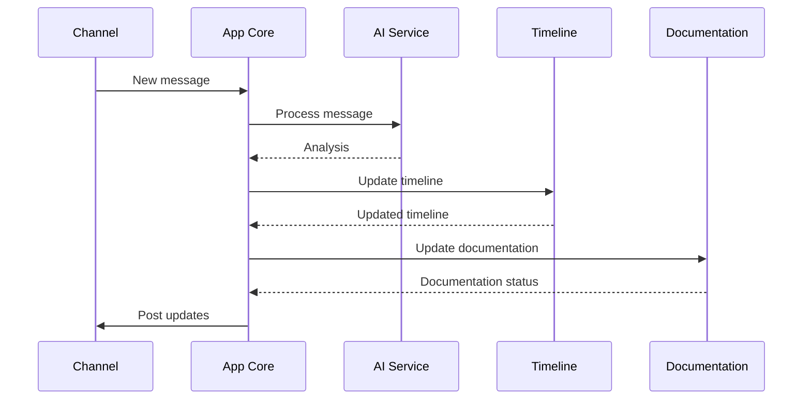
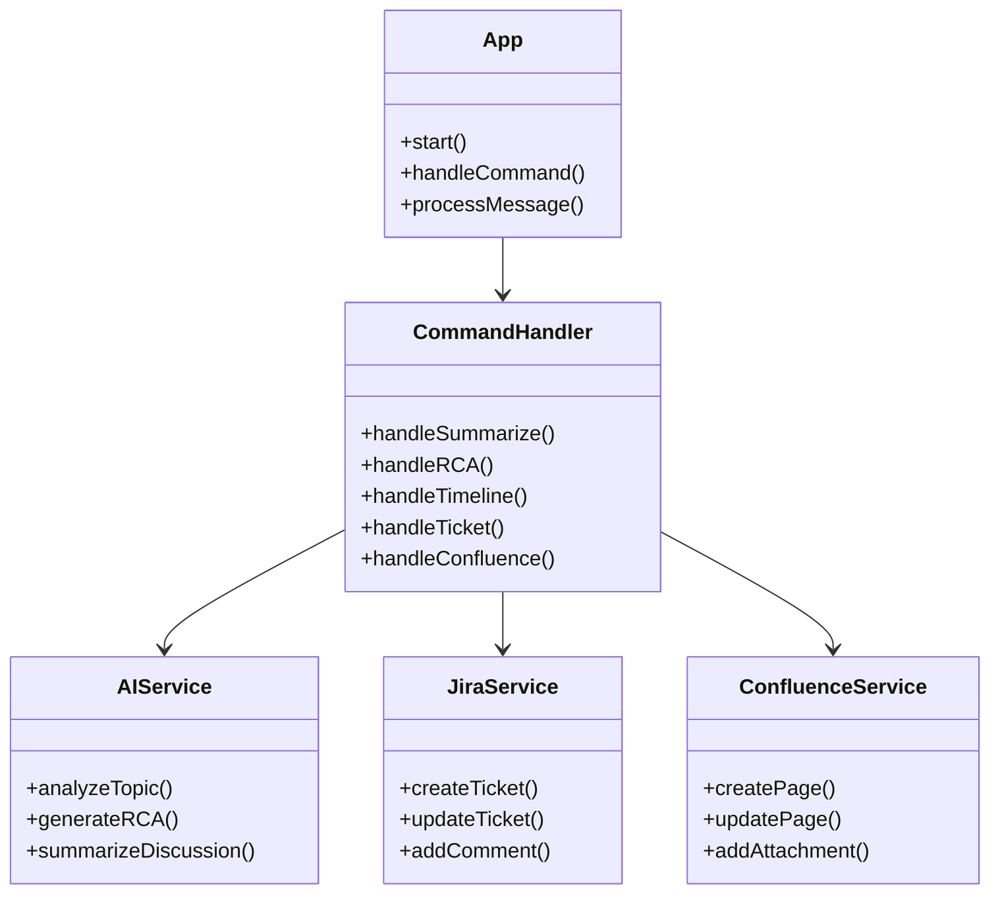
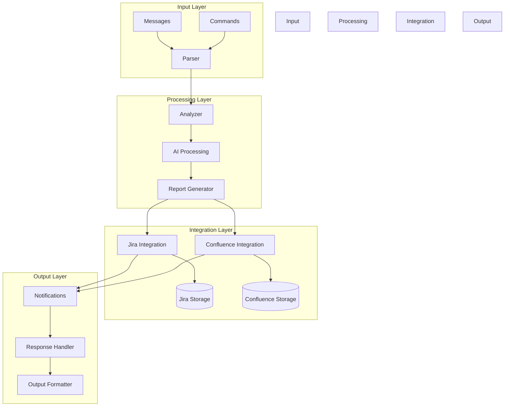
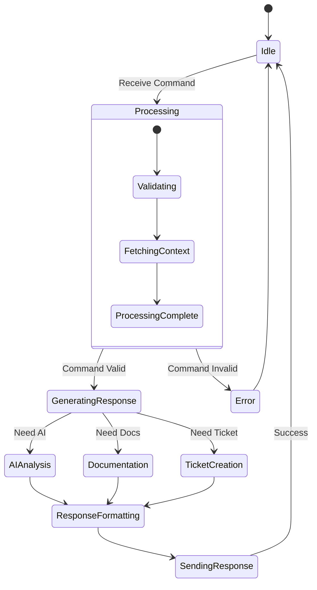
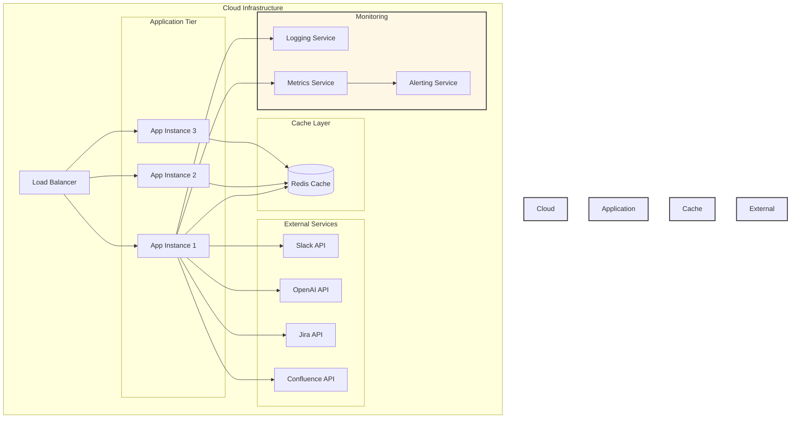
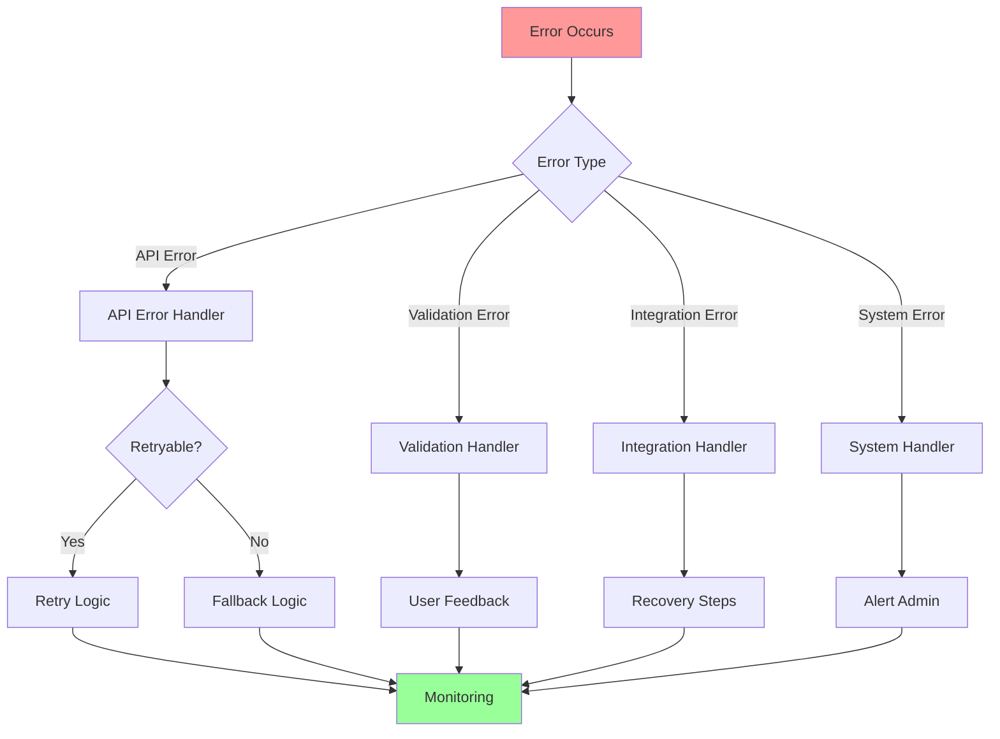

# Technical Diagrams

## 1. Sequence Diagrams

### Incident Management Flow

### Message Processing Flow

## 2. Component Architecture

## 3. Data Flow Diagram

## 4. State Machine Diagram

## 5. Infrastructure Architecture

## 6. Error Handling Flow

These diagrams provide different views of the system:

1. **Sequence Diagrams**
   - Incident management flow
   - Message processing flow

2. **Component Architecture**
   - Class relationships
   - Service interactions

3. **Data Flow Diagram**
   - Input/output flow
   - Processing stages
   - Storage integration

4. **State Machine Diagram**
   - Command processing states
   - Error handling states
   - System transitions

5. **Infrastructure Architecture**
   - Cloud components
   - Service scaling
   - Monitoring setup

6. **Error Handling Flow**
   - Error types
   - Recovery processes
   - Monitoring integration

Each diagram helps visualize a different aspect of the system, making it easier for developers and stakeholders to understand the architecture.
